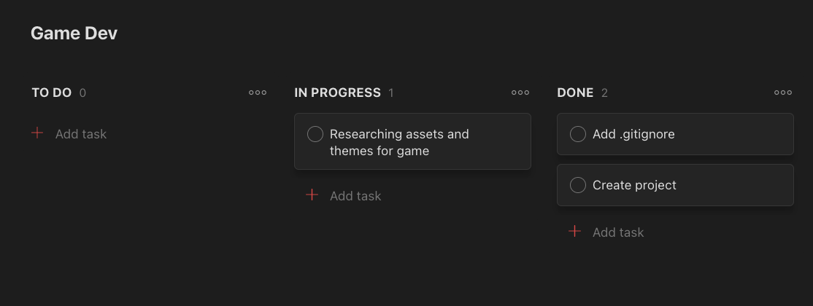

# Team and project
## Team code/name
> Team №7

## Team members list
1. > Прокопучук Д.І., ІО-93 - **team leader**
2. > Мусійчук Я.С., ІВ-91
3. > Чопик Н.О., ІВ-91

## Unity version
> 2020.3.27f1

 

# Lab
## About team task management (screenshot/description)
We use Todoist App for task management.

## Chosen games analysis
We decided to create 2d runner-platformed game.
The main idea is that the main character must escape 
from his enemy and overcome obstacles on his way.
We are intending to make a couple of different game levels 
with antagonists on the finish of each level.